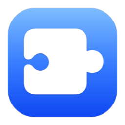

<p align="center">
  
</p>

<h1 align="center">SkillsUI</h1>

<p align="center">
  <strong>一款原生 macOS 应用，用于管理 AI 编程助手的技能包 — 浏览、安装并将 <a href="https://skills.sh">skills.sh</a> 上的技能分发到你所有的 Coding Agent。</strong>
</p>

<p align="center">
  <a href="https://developer.apple.com/swift/"></a>
  <a href="https://developer.apple.com/macos/"></a>
  <a href="https://developer.apple.com/xcode/swiftui/"></a>
  <a href="LICENSE"></a>
</p>

<p align="center">
  <a href="#功能特性">功能特性</a> •
  <a href="#快速开始">快速开始</a> •
  <a href="#项目结构">项目结构</a> •
  <a href="#支持的-agent">支持的 Agent</a> •
  <a href="README.md">English</a>
</p>

---

## 功能特性

| | 功能 | 说明 |
|---|---|---|
| 🧩 | **技能浏览器** | 查看所有已安装的全局技能，包含丰富的元数据、来源信息和渲染后的 SKILL.md |
| 🔍 | **应用内搜索** | 直接在 App 内搜索 [skills.sh](https://skills.sh)，一键安装 |
| 🤖 | **多 Agent 支持** | 支持向 20+ 个 Agent 安装技能 — Claude Code、Cursor、Codex、Windsurf、Gemini CLI 等 |
| 📂 | **快捷操作** | 在 Finder 中打开、跳转 GitHub、查看源码、移除技能 |
| 🔗 | **符号链接感知** | 自动检测并展示技能是符号链接还是拷贝 |
| 🏷️ | **智能分组** | 按来源仓库自动分组，配以语境化图标 |

## 快速开始

### 前置条件

- **macOS 26**（Tahoe）或更高版本
- **Xcode 26+**（或具备完整 macOS UI 宏支持的 Swift 6.2 工具链）
- [`npx skills`](https://skills.sh) CLI 已全局安装（`npm i -g skills`）

### 构建并运行

```bash
# 克隆项目
git clone https://github.com/IchenDEV/skills-ui.git
cd skills-ui

# 构建
swift build

# 运行
swift run SkillsUI
# — 或者 —
open .build/debug/SkillsUI
```

### 打包 DMG

```bash
./scripts/package-dmg.sh
open dist
```

运行后会产出：

- `dist/SkillsUI.app`
- `dist/SkillsUI.dmg`

安装方式就是标准 macOS 流程：打开 DMG，把 `SkillsUI.app` 拖进 `Applications`。

这一版打包主要用于本地分发和测试。脚本默认做 ad-hoc 签名，但还没有接 Developer ID 签名和 notarization。

如果你本机的 `xcode-select -p` 还指向 Command Line Tools，而 `/Applications/Xcode.app` 又已经装好了，打包脚本会自动切过去用完整 Xcode 工具链。

## 项目结构

```
Sources/
├── SkillsUIApp.swift          # @main 入口，窗口配置，应用图标
├── ContentView.swift           # TabView（已安装 / 应用市场）
├── SkillsSidebar.swift         # 侧栏列表，按来源分组
├── SkillDetailView.swift       # 详情面板 — 元数据网格 + SKILL.md
├── SkillMarkdownView.swift     # 原生 Textual 渲染器 + 本地 Markdown 样式
├── AddSkillSheet.swift         # 从 GitHub 添加技能的弹窗
├── MarketplaceView.swift       # 应用市场搜索界面
├── MarketplaceService.swift    # skills.sh API 客户端（actor）
├── MarketplaceSkill.swift      # 市场数据模型
├── SkillsManager.swift         # 核心状态管理 — 扫描、安装、移除
├── Skill.swift                 # 已安装技能模型
├── SkillParser.swift           # SKILL.md YAML frontmatter 解析器
└── SkillLock.swift             # .skill-lock.json Codable 类型

Packaging/
├── AppIcon.iconset/            # App 图标的源 PNG 集合
├── AppIcon.icns                # Finder / Dock 使用的打包图标
└── Info.plist.template         # App bundle 元数据模板

scripts/
├── package-dmg.sh              # 生成 SkillsUI.app 和 SkillsUI.dmg
└── render-app-icon.swift       # 重新生成仓库里的图标 PNG
```

### 设计理念

- **SwiftPM 可执行文件** — 无需 Xcode 项目，`swift build` 即可构建
- **`@Observable` + actor** — 全面采用 Swift 6 严格并发
- **零第三方 UI 依赖** — 纯 SwiftUI，原生 macOS 风格
- **`Textual`** — 直接承担原生块级 Markdown 渲染

## 工作原理

```
┌──────────────┐     npx skills add     ┌──────────────────┐
│  skills.sh   │ ◄──────────────────── │    SkillsUI      │
│  应用市场     │                        │  （本应用）       │
└──────┬───────┘                        └────────┬─────────┘
       │                                         │
       │  下载                            扫描 & 解析
       ▼                                         ▼
┌──────────────┐     符号链接            ┌──────────────────┐
│ ~/.agents/   │ ────────────────────► │ ~/.cursor/skills  │
│   skills/    │                        │ ~/.claude/skills  │
│              │                        │ ~/.codex/skills   │
│  SKILL.md    │                        │   ...             │
│  lock.json   │                        └──────────────────┘
└──────────────┘
```

## 支持的 Agent

SkillsUI 可以安装和检测以下 AI 编程助手的技能：

| Agent | 技能路径 |
|---|---|
| Amp | `~/.agents/skills` |
| Claude Code | `~/.claude/skills` |
| Codex | `~/.codex/skills` |
| Cursor | `~/.cursor/skills` |
| Windsurf | `~/.codeium/windsurf/skills` |
| Gemini CLI | `~/.gemini/skills` |
| GitHub Copilot | `~/.copilot/skills` |
| Roo Code | `~/.roo/skills` |
| Cline | `~/.cline/skills` |
| OpenCode | `~/.config/opencode/skills` |
| Trae | `~/.trae/skills` |
| Augment | `~/.augment/skills` |
| Droid | `~/.factory/skills` |
| Kiro | `~/.kiro/skills` |
| Warp | `~/.warp/skills` |
| Deep Agents | `~/.deepagents/agent/skills` |
| Antigravity | `~/.gemini/antigravity/skills` |
| OpenHands | `~/.openhands/skills` |
| Qwen Code | `~/.qwen/skills` |
| Trae CN | `~/.trae-cn/skills` |

## 贡献

1. Fork 本仓库
2. 创建功能分支（`git checkout -b feature/awesome`）
3. 提交改动（`git commit -m 'Add awesome feature'`）
4. 推送分支（`git push origin feature/awesome`）
5. 发起 Pull Request

## 许可证

本项目采用 MIT 许可证 — 详见 [LICENSE](LICENSE) 文件。

---

<p align="center">
  用 ❤️ 和 SwiftUI 构建
</p>
